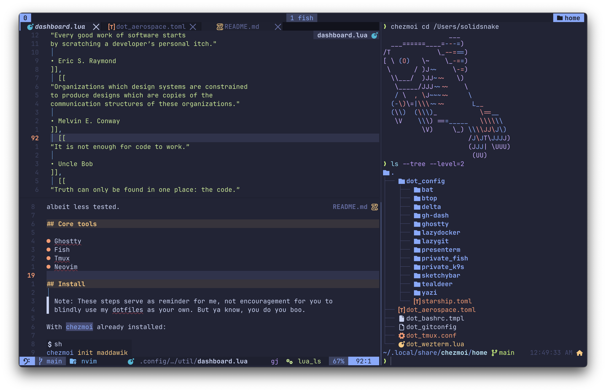

# dotfiles



These are my configuration files (le `dotfiles`), managed using
[chezmoi](https://www.chezmoi.io/)

Feel free to use anything you find here for inspiration in your own config.

It is primarily intended for use on MacOS as that is my daily driver for
work/home, I occasionally use linux so everything should work there as well,
albeit less tested.

## Core tools

- WezTerm
- Fish
- Tmux
- Neovim

## Install

> Note: These steps serve as reminder for me, not encouragement for you to
> blindly use my dotfiles as your own. But ya know, you do you boo.

With chezmoi already installed:

```sh
chezmoi init Mawdac
```

Batteries included:

```sh
sh -c "$(curl -fsLS get.chezmoi.io)" -- init --apply Mawdac
```

Transitory install (containers):

```sh
# Install dotfiles - then remove chezmoi, its source-dir and its config-dir
sh -c "$(curl -fsLS get.chezmoi.io)" -- init --one-shot Mawdac
```
